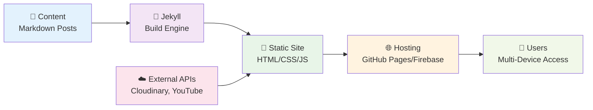
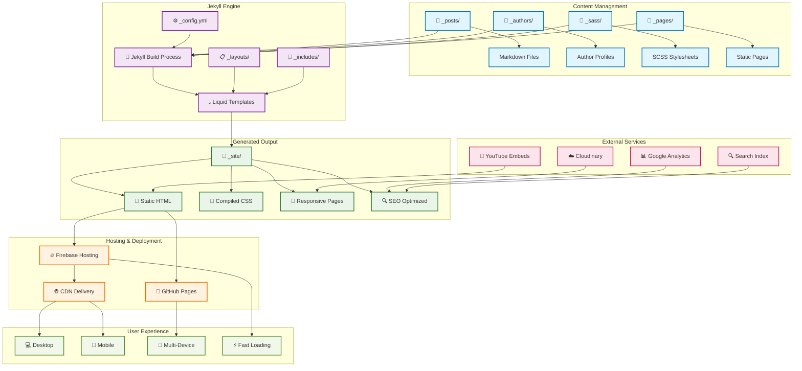

# 🏍️ Highway Nomads

[](https://jekyllrb.com/)
[](https://pages.github.com/)
[](https://firebase.google.com/)
[](https://highwaynomads.org)

> **A place for not just travel bloggers** - Where the road meets the soul, and every journey tells a story.

Highway Nomads is a beautifully crafted Jekyll-based travel blog that celebrates the spirit of adventure, motorcycle journeys, and the pursuit of freedom on two wheels. From scenic rides through the Western Ghats to exploring ancient forts steeped in history, we share stories that inspire wanderlust and fuel your next adventure.


## ✨ What Makes Us Special

### 🌟 **Adventure-Driven Content**
- **Motorcycle Travel Guides** - Detailed routes, tips, and experiences from seasoned riders
- **Historical Exploration** - Discover hidden gems and ancient sites across India
- **Digital Nomad Lifestyle** - Where technology meets travel and adventure
- **Visual Storytelling** - Rich multimedia content with stunning photography and embedded videos

### 🎯 **Our Focus Areas**
- 🏍️ **Motorcycle Adventures** - Royal Enfield rides, scenic routes, and bike maintenance tips
- 🏛️ **Heritage Tourism** - Ancient forts, temples, and historical significance
- 🌄 **Scenic Routes** - Western Ghats, hill stations, and off-beat destinations
- 💻 **Digital Nomadism** - Balancing remote work with travel adventures

## 🚀 Featured Content

### Recent Adventures
- **[Chasing History on Two Wheels: Krishnagiri Fort](/_posts/2025-01-20-chasing-history-on-himalyan-450-krishnagiri-fort-ride.md)** - A weekend escape from Bangalore exploring ancient fortifications
- **[Where Beauty Meets Curve: Exploring Agumbe Ghats](/_posts/2025-03-24-where-beauty-meets-curve-exploring-agumbe-ghats.md)** - Navigating the serpentine roads of the Western Ghats
- **[Where Signal Drops: Bytes, Bikes & Real Connections](/_posts/2025-03-30-where-signal-drops-bytes-bike-real-connections.md)** - Finding balance between digital life and authentic experiences
- **[Unique Things to Do in Bangalore](/_posts/2025-05-08-unique-things-to-do-in-bangalore.md)** - Beyond IT parks: The soul of India's Silicon Valley

## 🛠️ Technology Stack

This blog is built with modern web technologies to ensure fast, responsive, and SEO-friendly performance:

- **[Jekyll](https://jekyllrb.com/)** - Static site generator for fast, secure websites
- **[Ruby](https://www.ruby-lang.org/)** - Programming language powering Jekyll
- **[Liquid](https://shopify.github.io/liquid/)** - Template language for dynamic content
- **[Kramdown](https://kramdown.gettalong.org/)** - Markdown processor for content formatting
- **[Sass](https://sass-lang.com/)** - CSS extension language for maintainable styles
- **[Firebase Hosting](https://firebase.google.com/products/hosting)** - Fast and secure web hosting
- **[GitHub Pages](https://pages.github.com/)** - Continuous deployment and version control

## 🏗️ Project Architecture

### System Overview



### Detailed Architecture



### 📐 Architecture Overview

The Highway Nomads project follows a modern static site generation architecture with the following key components:

#### **Content Layer**
- **Posts (`_posts/`)**: Markdown files for blog posts with YAML front matter
- **Authors (`_authors/`)**: Individual author profiles and biographical information  
- **Pages (`_pages/`)**: Static pages like About, Contact, Videos
- **Styles (`_sass/`)**: Modular SCSS stylesheets organized by component

#### **Build Layer**
- **Jekyll Engine**: Processes Markdown, Liquid templates, and Sass into static HTML/CSS
- **Liquid Templates**: Dynamic template language for data-driven content
- **Layouts (`_layouts/`)**: Page templates (post, page, author, default)
- **Includes (`_includes/`)**: Reusable template components (header, footer, widgets)

#### **Output Layer**
- **Static Site (`_site/`)**: Generated HTML, CSS, JS, and optimized assets
- **SEO Optimization**: Structured data, meta tags, sitemaps
- **Responsive Design**: Mobile-first approach with optimized performance

#### **Deployment Layer**
- **GitHub Pages**: Automatic deployment from main branch
- **Firebase Hosting**: Alternative hosting with global CDN
- **CI/CD Pipeline**: Automated builds and deployments via GitHub Actions

#### **Integration Layer**
- **Cloudinary**: Image optimization and responsive delivery
- **YouTube**: Embedded video content and vlogs
- **Google Analytics**: Traffic insights and user behavior tracking
- **Search**: Client-side search functionality for content discovery

### 🎨 **Features**
- ✅ Responsive design optimized for all devices
- ✅ SEO-optimized with proper meta tags and sitemap
- ✅ Fast loading times with optimized assets
- ✅ Multi-author support with individual author pages
- ✅ Tag-based content organization
- ✅ Pagination for better content discovery
- ✅ Social media integration
- ✅ YouTube video embedding
- ✅ Image optimization with Cloudinary
- ✅ RSS feed for content syndication

## 🏗️ Quick Start

### Prerequisites
- Ruby 2.7.0 or higher
- Bundler gem
- Git

### Local Development

1. **Clone the repository**
   ```bash
   git clone https://github.com/sivolko/highway.git
   cd highway
   ```

2. **Install dependencies**
   ```bash
   bundle install
   ```

3. **Start the development server**
   ```bash
   bundle exec jekyll serve
   ```

4. **Open your browser**
   ```
   http://localhost:4000
   ```

Your site will automatically rebuild when you make changes to source files.

### 🚀 Deployment

This site is configured for multiple deployment options:

#### GitHub Pages (Automatic)
- Push to `main` branch
- GitHub Pages automatically builds and deploys

#### Firebase Hosting
```bash
# Install Firebase CLI
npm install -g firebase-tools

# Build the site
bundle exec jekyll build

# Deploy to Firebase
firebase deploy
```

## 📝 Content Management

### Creating New Posts

1. Create a new file in `_posts/` following the naming convention:
   ```
   YYYY-MM-DD-title-of-your-post.md
   ```

2. Add the front matter:
   ```yaml
   ---
   layout: post
   title: Your Amazing Adventure Title
   description: A brief description of your journey
   date: 2025-01-20 18:05:55 +0300
   author: admin
   image: 'https://your-image-url.jpg'
   video_embed: https://www.youtube.com/embed/your-video-id
   tags: [bike, adventure, travel]
   featured: true
   ---
   ```

3. Write your content using Markdown

### Adding Authors

Create a new file in `_authors/` with author information:

```yaml
---
layout: author
name: Your Name
avatar: https://your-avatar-url.jpg
bio: Brief bio about the author
social:
  - title: instagram
    url: https://instagram.com/yourhandle
  - title: youtube
    url: https://youtube.com/yourchannel
---
```

## 🎨 Customization

### Styling
- Main styles are in `_sass/` directory
- Customize colors, fonts, and layouts
- All styles are compiled automatically

### Configuration
Edit `_config.yml` to customize:
- Site title and description
- Author information
- Social media links
- SEO settings
- Plugin configurations

## 🤝 Contributing

We welcome contributions from fellow travelers and developers! Here's how you can help:

### Content Contributions
- 📝 **Write Travel Stories** - Share your motorcycle adventures
- 📸 **Photography** - Submit stunning travel photography
- 🎥 **Video Content** - Create vlogs and travel videos
- 🗺️ **Route Guides** - Document new scenic routes

### Technical Contributions
- 🐛 **Bug Reports** - Help us improve the site
- ✨ **Feature Requests** - Suggest new functionality
- 💻 **Code Contributions** - Submit pull requests
- 📖 **Documentation** - Improve our guides

### How to Contribute

1. Fork the repository
2. Create a feature branch (`git checkout -b feature/amazing-feature`)
3. Commit your changes (`git commit -m 'Add some amazing feature'`)
4. Push to the branch (`git push origin feature/amazing-feature`)
5. Open a Pull Request

## 📊 Analytics & Performance

- **Google Analytics** integration for traffic insights
- **Performance optimized** with compressed assets
- **SEO optimized** with proper structured data
- **Mobile-first** responsive design
- **Fast loading** with optimized images via Cloudinary

## 🌍 Community

Join our community of highway nomads and adventure seekers:

- **Website**: [highwaynomads.org](https://highwaynomads.org)
- **GitHub**: [@sivolko](https://github.com/sivolko)
- **YouTube**: Featured video content and vlogs
- **Instagram**: Daily adventure updates and photography

## 📄 License

This project is open source and available under the [MIT License](LICENSE).

---

## 🙏 Acknowledgments

- **Jekyll Community** - For the amazing static site generator
- **GitHub** - For hosting and version control
- **Firebase** - For reliable hosting services
- **Cloudinary** - For image optimization and delivery
- **Travel Photography Community** - For inspiring visual content

---

<div align="center">

**Made with ❤️ by Highway Nomads**

*Where every mile tells a story*

[](https://github.com/sivolko/highway)
[](https://github.com/sivolko/highway/fork)
[](https://github.com/sivolko/highway)

</div>